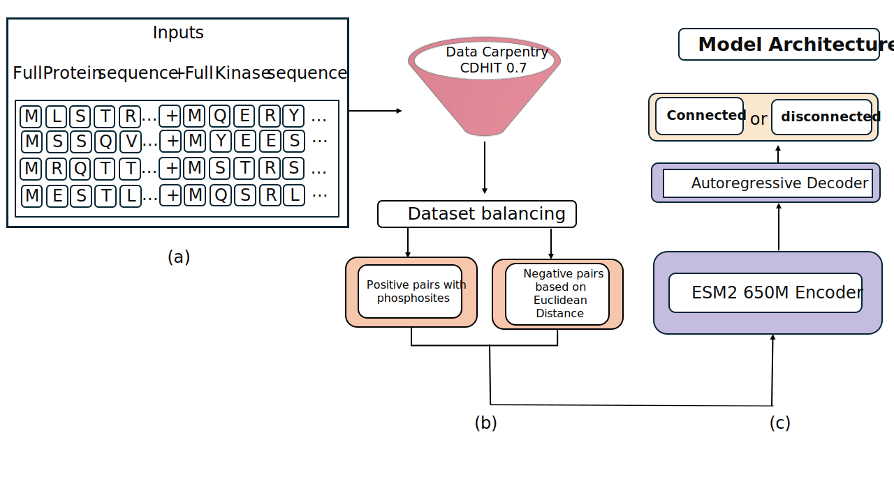

# **Kinase-Substrate Prediction Using an Autoregressive Model**  

**Farzaneh Esmaili**<sup>1</sup> · **Yongfan Qin**<sup>1</sup> · **Duolin Wang**<sup>1</sup> · **Dong Xu**<sup>1*</sup>  
<sup>1</sup> University of Missouri  

---
## 📖 Citation  

If you use this work, please cite:  

```bibtex
@article{esmailikinase,
  title={Kinase-substrate prediction using an autoregressive model},
  author={Esmaili, Farzaneh and Qin, Yongfang and Wang, Duolin and Xu, Dong},
  journal={Computational and Structural Biotechnology Journal},
  publisher={Elsevier}
}
```
---

## **🔬 Abstract**  
In this study, we introduce an innovative approach leveraging an **autoregressive model** to predict kinase-substrate pairs. Unlike traditional methods focused on **site-specific phosphorylation prediction**, our approach addresses kinase-specific **protein substrate prediction** at the **protein level**, rather than specific phosphorylation sites. We redefine this problem as a **protein-protein interaction (PPI) prediction** task.  

Our model integrates the **protein large language model ESM-2** as the encoder and employs an **autoregressive decoder** to classify kinase-protein interactions as either `"connected"` or `"disconnected"`. A **hard negative strategy**, based on kinase embedding distances computed from **ESM-2**, enables the model to **distinguish positive from negative samples effectively**.  

While independent test results demonstrate **strong overall performance**, real-world applications often require ranking multiple potential kinases. Therefore, we conducted a **top-k analysis** to evaluate how well our model prioritizes the most likely kinase candidates.  

Additionally, our model supports **zero-shot prediction**, meaning it can predict substrates for kinases **even when no known substrates are available**, a capability that **conventional methods lack**. Our model’s robust **generalization to novel kinases** and **underrepresented groups** highlights its broad utility and versatility.  

---

## **🛠 Model Integration**  
This model builds upon our previous model, **[Prot2Token](https://github.com/mahdip72/prot2token/tree/master)**, and is **integrated into Prot2Token as a new task**.  

<p align="center">
  
</p>

---

## **🚀 Installation & Setup**  

### **🔹 Conda Environment Setup**  
To create and activate a **new Conda environment**, run:  
```bash
conda create --name substrate_kinase_interaction python=3.10
conda activate substrate_kinase_interaction
```

### **🔹 Install Dependencies**  
```bash
pip install -r requirements.txt
pip install prot2token

```


---

## **📊 Prediction Tutorial**  
To use the **kinase-substrate interaction model** for making predictions, follow the example code below:

```python
from prot2token.models import prepare_models

# Load model
net = prepare_models(name='kinase_interaction', device='cuda', compile_model=True)

# Example sequences
substrate_sequence = ["MEETMKLATMEDTVEYCLFLIPDESRDSDKHKEILQKYIERIITRFAPMLVPYIWQNQPFNLKYKPGKGGVPAHMFGVTKFGDNIEDEWFIVYVIKQITKEFPELVARIEDNDGEFL"]
kinase_sequence = ["MSGPVPSRARVYTDVNTHRPREYWDYESHVVEWGNQDDYQLVRKLGRGKYSEVFEAINITNNEKVVVKILKPVKKKKIKREIKILENLRGGPNIITLADIVKDPVSRTPALVFEHVNNTDFKQLYQTLTDYDIRFYMYEILKALDYCHSMGIMHRDVKPHNVMIDHEHRKLRLIDWGLAEFYHPGQEYNVRVASRYFKGPELLVDYQMYDYSLDMWSLGCMLASMIFRKEPFFHGHDNYDQLVRIAKVLGTEDLYDYIDKYNIELDPRFNDILGRHSRKRWERFVHSENQHLVSPEALDFLDKLLRYDHQSRLTAREAMEHPYFAQQ"]

# Run prediction
results = net.run(substrate_sequence, kinase_sequence, merging_character='')
print(results)
```

### **🔹 Example Output**
```bash
["MEETMKLATMEDTVEYCLFLIPDESRDSDKHKEILQKYIERIITRFA<EOS>MSGPVPSRARVYTDVNTHRPREYWDYESHVVEWGNQDDYQLVRKLGRGKYS", "<task_kinase_interaction>", "connected"]
```

---

## **📂 Dataset Overview**  

The datasets are stored in the `data/` directory and include:  

- 📌 **Independent test data**  
- 📌 **NKP zero-shot data**  
- 📌 **Training data**  
- 📌 **Positive test data**  

The process of generating **negative samples** and preparing the **final dataset** is implemented in [`preprocess.py`](preprocess.py).  

---

## **📊 Training the Model**  
To train the model using a specific configuration file:  

```bash
python train.py --config_path <config.yml>
```

---

## **🛠 Web Server**  
A **web server** will be provided soon!

---

## **📧 Contact**  
For any questions or issues, please feel free to reach out via GitHub or email.  

🚀 **Happy Coding!** 🚀
